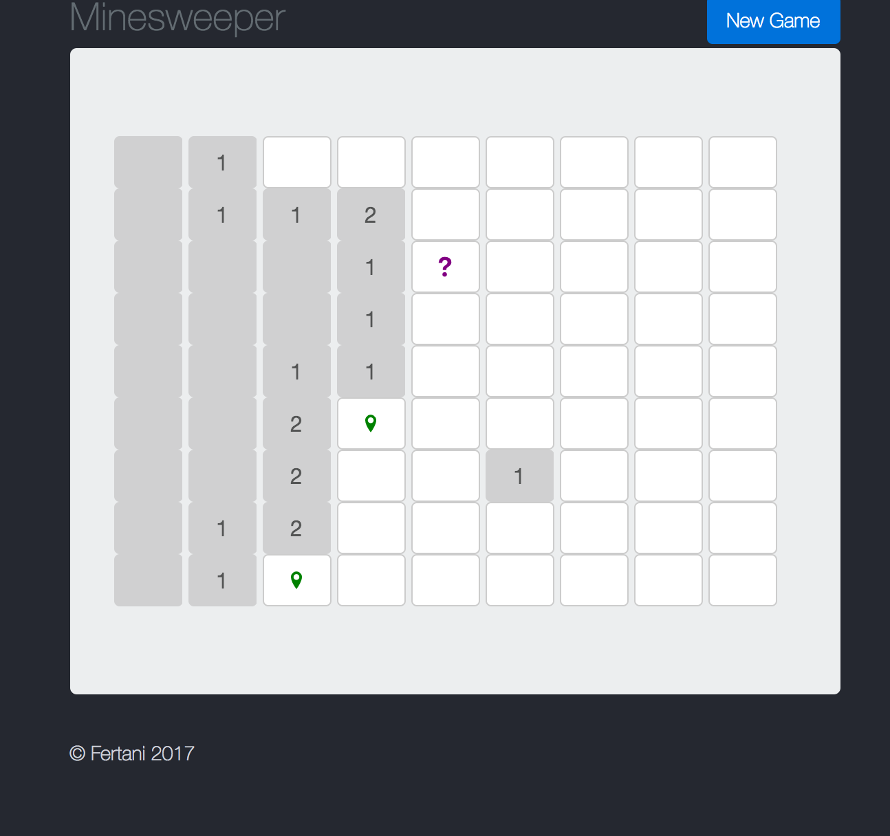

# MinesweeperApp

This project was generated with [Angular CLI](https://github.com/angular/angular-cli) version 1.3.0.

## Build project

Run `npm start` to build & run project. Navigate to `http://localhost:4200/`.

### Build angular sub-project

Run `ng build` to build angular sub-project. This will re-generate **dist** folder.

## IHM

## Further help

To get more help on the Angular CLI use `ng help` or go check out the [Angular CLI README](https://github.com/angular/angular-cli/blob/master/README.md).